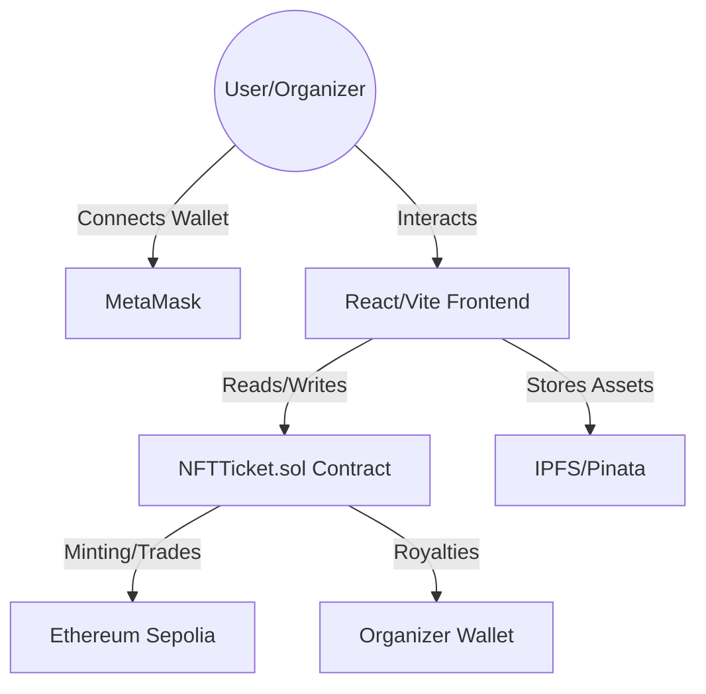

# NETIX — Decentralized NFT Ticketing Revolution 


**NETIX** is a next-generation decentralized application (dApp) designed to transform the event ticketing industry. By utilizing Non-Fungible Tokens (NFTs) on the Ethereum blockchain, NETIX eliminates ticket fraud, ensures verifiable ownership, and establishes a fair secondary market with automated royalty enforcement.

---

##  Project Team: Blacknova
| Name | Roll Number | 
| :--- | :--- | :--- |
| **Kadasani Aswartha Karthik Reddy** | 240001036 | 
| **Mannepalli Sai Adithya** | 240001044 | 
| **Yelisetti Vignesh** | 240001083 | 
| **Katasani Vishnu Vardhan Reddy** | 240001040 | 
| **Boddu Kunal** | 240003020 | 
| **Kesavarapu Deepak Reddy** | 240041022 | 

---

##  System Architecture

NETIX follows a decentralized architecture where the frontend interacts directly with the blockchain (Sepolia Testnet) and distributed storage (IPFS).



---

##  Feature Deep-Dive

### 1. Organizer Management Suite
*   **Decentralized Event Deployment**: Organizers deploy immutable event contracts directly from their dashboard.
*   **IPFS-Backed Metadata**: All event banners and descriptions are stored on IPFS, ensuring the data remains permanent and tamper-proof.
*   **Financial Analytics**: A premium dashboard tracking total revenue, tickets sold across tiers, and real-time network latency (ping).
*   **Tiered Ticketing Engine**: Supports **Silver, Gold, and VIP** tiers, each with its own supply and price points defined at creation.

### 2. Ticketing & Minting Engine
*   **Primary Sales**: Direct-to-fan minting avoids middleman markups.
*   **Batch Purchase Logic**: Optimized smart contract functions allow users to buy multiple tickets across different tiers in a single transaction, saving on cumulative gas fees.
*   **Dynamic Metadata**: Each ticket's tier and event ID are encoded on-chain, verifiable by any block explorer.

### 3. Secondary Marketplace (P2P)
*   **Secure Resale**: Owners can list their tickets for resale by specifying a price in ETH.
*   **Escrow-less Trading**: The contract handles the transfer of ownership and funds atomically, preventing "double-spend" or payment fraud.
*   **EIP-2981 Standard**: Automated royalty distribution. On every resale, a percentage (defined by the organizer) is instantly routed to the organizer's wallet.

---

##  Tech Stack Highlights

- **Frontend**: **React 18** with **Vite** for ultra-fast HMR and build times.
- **Styling**: **Tailwind CSS** with a custom "Glassmorphism" design system.
- **Animations**: **Framer Motion** for smooth page transitions and micro-interactions.
- **State Management**: **Zustand** for lightweight, high-performance global state (Handling wallet and event data).
- **Blockchain Interaction**: **Ethers.js v6** for secure communication with the Ethereum network.
- **Smart Contracts**: **Solidity 0.8.20**, utilizing **OpenZeppelin** libraries for ERC-721 and Access Control.

---

##  Prerequisites & Setup

### Requirements
- **Node.js**: `v18.x` or higher
- **Package Manager**: `npm v9.x` or `yarn`
- **Wallet**: **MetaMask** installed in your browser.
- **Network**: **Ethereum Sepolia Testnet** (Add via [Chainlist](https://chainlist.org/chain/11155111)).
- **Funds**: Sepolia ETH (Available at [Alchemy Faucet](https://sepoliafaucet.com/)).

### Installation Steps

1.  **Clone & Install Root Dependencies**
    ```bash
    git clone [your-repo-url]
    cd CS218-Blacknova-NFT_EVENT_TICKETING
    npm install
    ```

2.  **Smart Contract Compilation**
    ```bash
    npx hardhat compile
    ```

3.  **Frontend Setup**
    ```bash
    cd frontend
    npm install
    ```

4.  **Environment Setup**
    Create a `.env` in `frontend/` and add:
    ```env
    VITE_CONTRACT_ADDRESS=0x... # Your deployed NFTTicket address
    VITE_PINATA_API_KEY=your_key
    VITE_PINATA_SECRET_KEY=your_secret
    ```

---

## Smart Contract Specification (`NFTTicket.sol`)

| Function | Description |
| :--- | :--- |
| `createEvent(...)` | Initializes event metadata, tiers, and royalty rates. |
| `buyTicket(...)` | Mints a specific tier ticket for a user. |
| `buyBatchTickets(...)` | Optimized multi-tier, multi-quantity purchase. |
| `listForResale(...)` | Creates an active listing in the secondary marketplace. |
| `buyResaleTicket(...)` | Atomic transfer of NFT to buyer and ETH to seller + organizer. |
| `royaltyInfo(...)` | Returns royalty recipient and amount based on sale price (EIP-2981). |

---

##  Future Requirements & Roadmap

### Phase 1: Verification (Short-term)
- [ ] **Offline QR Verification**: A mobile-friendly scanner for event entry that verifies ticket ownership via a signed message.
- [ ] **Push Notifications**: Real-time alerts for successful purchases or resale bids via Push Protocol.

### Phase 2: Financial Expansion (Mid-term)
- [ ] **Dynamic Pricing (Dutch Auctions)**: Allow organizers to start tickets at a high price that decreases over time to find the perfect market fit.
- [ ] **Fiat On-ramps**: Integration with Stripe or MoonPay to allow fans to buy NFT tickets using credit cards.

### Phase 3: Ecosystem (Long-term)
- [ ] **Governance (DAO)**: Implement a platform token for holders to vote on feature updates and platform fees.
- [ ] **Cross-Chain Support**: Bridge tickets to Layer 2s like Arbitrum or Polygon to reduce gas costs for attendees.

---

##  Troubleshooting

- **Transaction Reverted**: Ensure you have enough Sepolia ETH for gas. Check if the event ticket supply has reached its limit.
- **Wallet Not Connecting**: Ensure your MetaMask is set to the **Sepolia Test Network**.
- **Images Not Loading**: IPFS gateways can sometimes be slow; ensure your Pinata keys are correctly configured in the `.env`.

---

## License
Distributed under the **MIT License**. See `LICENSE` for more information.

---

Developed  by **Team Blacknova** for the Future of Ticketing.
