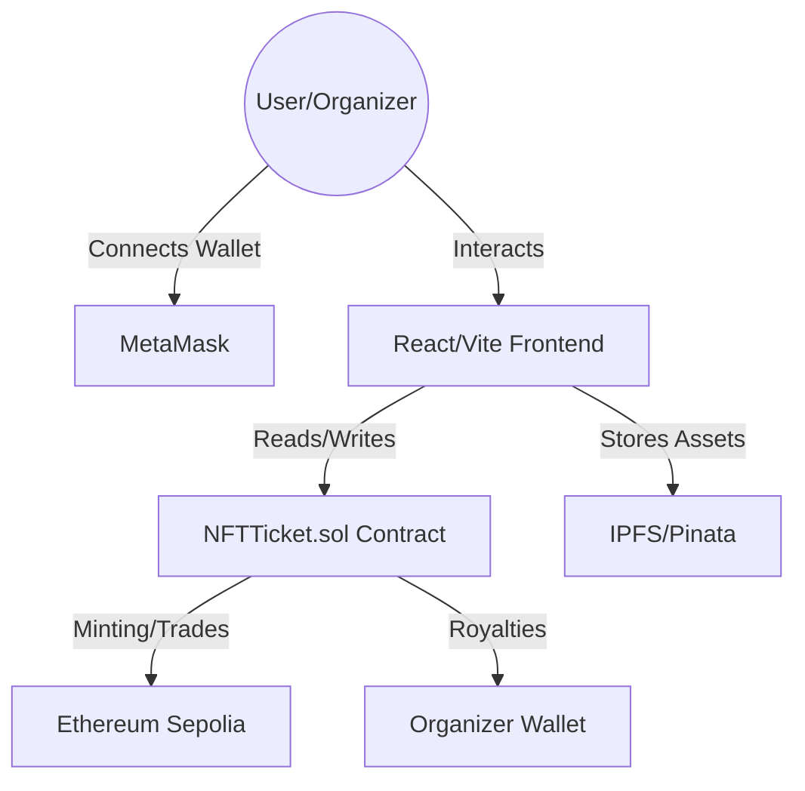

# NETIX — Decentralized NFT Ticketing Revolution 


**NETIX** is a next-generation decentralized application (dApp) designed to transform the event ticketing industry. By utilizing Non-Fungible Tokens (NFTs) on the Ethereum blockchain, NETIX eliminates ticket fraud, ensures verifiable ownership, and establishes a fair secondary market with automated royalty enforcement.

---

##  Project Team: Blacknova
| Name | Roll Number | 
| :--- | :--- | 
| **Kadasani Aswartha Karthik Reddy** | 240001036 | 
| **Mannepalli Sai Adithya** | 240001044 | 
| **Yelisetti Vignesh** | 240001083 | 
| **Katasani Vishnu Vardhan Reddy** | 240001040 | 
| **Boddu Kunal** | 240003020 | 
| **Kesavarapu Deepak Reddy** | 240041022 | 

---

##  System Architecture

NETIX follows a decentralized architecture where the frontend interacts directly with the blockchain (Sepolia Testnet) and distributed storage (IPFS).


```mermaid
graph TD
    User((User/Organizer)) -->|Connects Wallet| MM[MetaMask]
    User -->|Interacts| FE[React/Vite Frontend]
    FE -->|Reads/Writes| SC[NFTTicket.sol Contract]
    FE -->|Stores Assets| IPFS[IPFS/Pinata]
    SC -->|Minting/Trades| BC[Ethereum Sepolia]
    SC -->|Royalties| ORG[Organizer Wallet]
```

---

##  Feature Deep-Dive

### 1. Organizer Management Suite
*   **Decentralized Event Deployment**: Organizers deploy immutable event contracts directly from their dashboard with up to 5 tiers.
*   **IPFS-Backed Metadata**: All event banners and descriptions are stored on IPFS, ensuring the data remains permanent and tamper-proof.
*   **Event Lifecycle Control**: Edit tier prices/supplies or **Cancel** an event to trigger automated user refunds.
*   **Decentralized Validation**: Add authorized "Scanners" to verify tickets at the venue gate.
*   **Referral & Promoter Engine**: 
    *   **How it Works**: Organizers can assign specific wallets as "Referrers" with a custom commission rate (basis points).
    *   **Access Control**: Only the event organizer has the authority to add or remove referrers.
    *   Commission is automatically deducted from the ticket price and routed to the promoter instantly upon a successful mint.

### 2. Ticketing & Minting Engine
*   **Primary Sales**: Direct-to-fan minting avoids middleman markups.
*   **Organizer Restriction**: To ensure market integrity, **the event creator is strictly prohibited from buying their own tickets** (both primary and resale).
*   **Batch Purchase Logic**: Optimized smart contract functions allow users to buy multiple tickets across different tiers in a single transaction, saving on gas.
*   **Secure QR Validation**: On-chain verifiable entry system to prevent ticket duplication.

### 3. Secondary Marketplace (P2P)
*   **Secure Resale with Price Caps**: Owners can list tickets for resale, with prices capped by the organizer (e.g., max 10% markup) to prevent scalping.
*   **No Organiser Buying**: Organizers cannot buy tickets on the secondary market to inflate prices.
*   **Escrow-less Trading**: Atomic transfer of ownership and funds, preventing fraud.
*   **EIP-2981 Standard**: Automated royalty distribution ensures organizers receive a percentage of every resale.

---

##  Screenshots
> [!IMPORTANT]
> Save your screenshots as `marketplace.png` and `mytickets.png` in the **root directory** of this project for them to appear here.

### 🛒 Marketplace


### My Tickets


---

##  Tech Stack Highlights

- **Frontend**: **React 18** with **Vite** for ultra-fast performance.
- **Styling**: **Tailwind CSS** with a custom "Glassmorphism" design system.
- **Animations**: **Framer Motion** for smooth page transitions.
- **State Management**: **Zustand** for lightweight global state management.
- **Blockchain Interaction**: **Ethers.js v6** for secure communication.
- **Smart Contracts**: **Solidity 0.8.20**, utilizing **OpenZeppelin** libraries.

---

##  Prerequisites & Setup

### Requirements
- **Node.js**: `v18.x` or higher
- **Package Manager**: `npm v9.x` or `yarn`
- **Wallet**: **MetaMask** installed.
- **Network**: **Ethereum Sepolia Testnet**.
- **Funds**: Sepolia ETH (Available at [Alchemy Faucet](https://sepoliafaucet.com/)).

### Smart Contract Deployment

To deploy a new instance of the **NFTTicket** contract:

1.  **Configure Root Environment**:
    Create a `.env` file in the **root directory** (not inside `frontend/`):
    ```env
    RPC_URL=https://eth-sepolia.g.alchemy.com/v2/your_key
    PRIVATE_KEY=your_wallet_private_key
    ```

2.  **Deploy to Sepolia**:
    Run the deployment script using Hardhat:
    ```bash
    npx hardhat run scripts/deploy.js --network sepolia
    ```

3.  **Update Frontend**:
    Once deployed, copy the new contract address from the terminal and update `VITE_CONTRACT_ADDRESS` in `frontend/.env`.

---

###  Frontend & Installation Steps

1.  **Clone & Install Root Dependencies**:
    ```bash
    git clone [your-repo-url]
    cd CS218-Blacknova-NFT_EVENT_TICKETING
    npm install
    ```

2.  **Compile Smart Contracts**:
    ```bash
    npx hardhat compile
    ```

3.  **Frontend Setup**:
    ```bash
    cd frontend
    npm install
    ```

4.  **Environment Configuration**:
    Create a `.env` in `frontend/` and add:
    ```env
    VITE_CONTRACT_ADDRESS=your_contract_address
    VITE_PINATA_JWT=your_pinata_jwt_here
    ```

5.  **Run Locally**:
    ```bash
    npm run dev
    ```

---

## Smart Contract Specification (`NFTTicket.sol`)

The NETIX smart contract implements the following core functions with full NatSpec documentation for developers.

### 🛠️ Event Management
- **`createEvent(string ipfsHash, uint8 royaltyBps, uint256[] prices, uint256[] supplies, uint8 maxResaleMarkupPct)`**
    - `@notice`: Initializes a new event with multiple tiers, royalty rates, and resale caps.
    - `@param ipfsHash`: The IPFS CID containing event metadata (banners, description).
    - `@param prices`: Array of ticket prices in Wei for each tier.
- **`editEvent(uint256 eventId, uint256[] newPrices, uint256[] newSupplies)`**
    - `@notice`: Updates the prices and supplies for an existing event's tiers.
    - `@param newSupplies`: Updated max supply (must be >= current sold).
- **`cancelEvent(uint256 eventId)`**
    - `@notice`: Cancels an event and locks funds for ticket holder refunds.
    - `@param eventId`: Unique ID of the event to cancel.

###  Ticketing & Referral
- **`buyTicket(uint256 eventId, uint256 tierId)`**
    - `@notice`: Purchases and mints a single ticket for a specific tier.
- **`buyBatchTickets(uint256 eventId, uint256[] tierIds, uint24[] quantities)`**
    - `@notice`: Optimized multi-tier, multi-quantity purchase in one transaction.
- **`addReferral(uint256 eventId, address referrer, uint256 bps)`**
    - `@notice`: Configures a referral reward for a specific promoter wallet.
    - `@param bps`: The commission rate in basis points (e.g. 500 = 5%).

###  Secondary Marketplace
- **`listForResale(uint256 tokenId, uint256 priceWei)`**
    - `@notice`: Lists an owned ticket for resale with price cap validation.
    - `@param priceWei`: Resale price (cannot exceed original price + markup cap).
- **`buyResaleTicket(uint256 tokenId)`**
    - `@notice`: Atomic transfer of NFT with royalty distribution.
- **`claimRefund(uint256 tokenId)`**
    - `@notice`: Allows users to claim a full refund if an event is cancelled.

###  Access Control & Validation
- **`addScanner(uint256 eventId, address scanner)`**
    - `@notice`: Authorizes a wallet address to act as a ticket scanner.
- **`validateTicketEntry(uint256 tokenId, address expectedAttendee)`**
    - `@notice`: Marks a ticket as 'Used' on-chain at the venue gate.
    - `@param expectedAttendee`: The wallet address of the person presenting the ticket.

---

##  Future Enhancements

-  **Proof of Attendance (POAP)**: Automatically mint commemorative NFT badges for attendees who successfully validate their tickets at the gate.
-  **Social Tiering**: Unlock exclusive "VIP-only" community chats or early-bird access based on previous event attendance history.
-  **Dynamic Pricing Oracle**: Implement bonding curves or demand-based pricing for primary ticket sales.
-  **Fiat onramps for ticket purchase**: Allow users to buy NFT tickets using credit cards and local currency via Stripe/MoonPay.
-  **WalletConnect & Coinbase Wallet support**: Expanding accessibility beyond MetaMask.

---

##  Troubleshooting

- **Transaction Reverted**: 
    - Ensure you have enough Sepolia ETH for gas. 
    - If buying, check if the tier is sold out.
    - If you are the event organizer, remember that **you cannot buy your own tickets**.
- **Referral Not Working**: Only the organizer can authorize a referrer. Ensure the promoter's address was added via `addReferral` with a valid bps (max 50%).
- **Scanner Access Denied**: Ensure your wallet address has been added to the authorized scanners list for that specific event.
- **Wallet Not Connecting**: Ensure your MetaMask is set to the **Sepolia Test Network**.
- **Images Not Loading**: IPFS gateways can sometimes be slow; ensure your Pinata keys are correctly configured and the hash is valid.

---

Developed by **Team Blacknova** for the Future of Ticketing.
