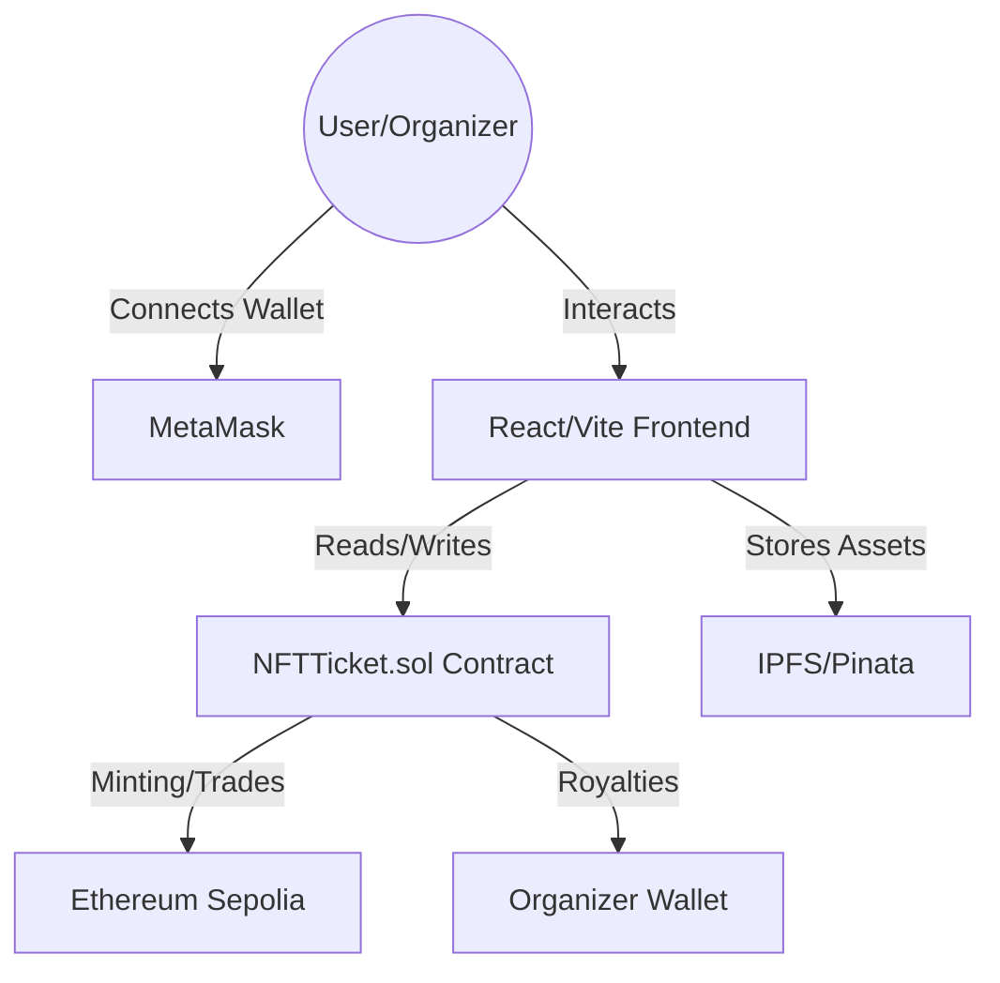
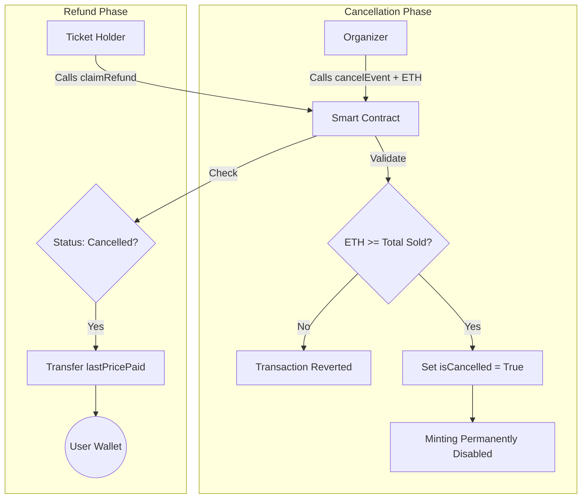
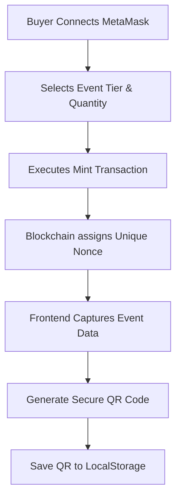
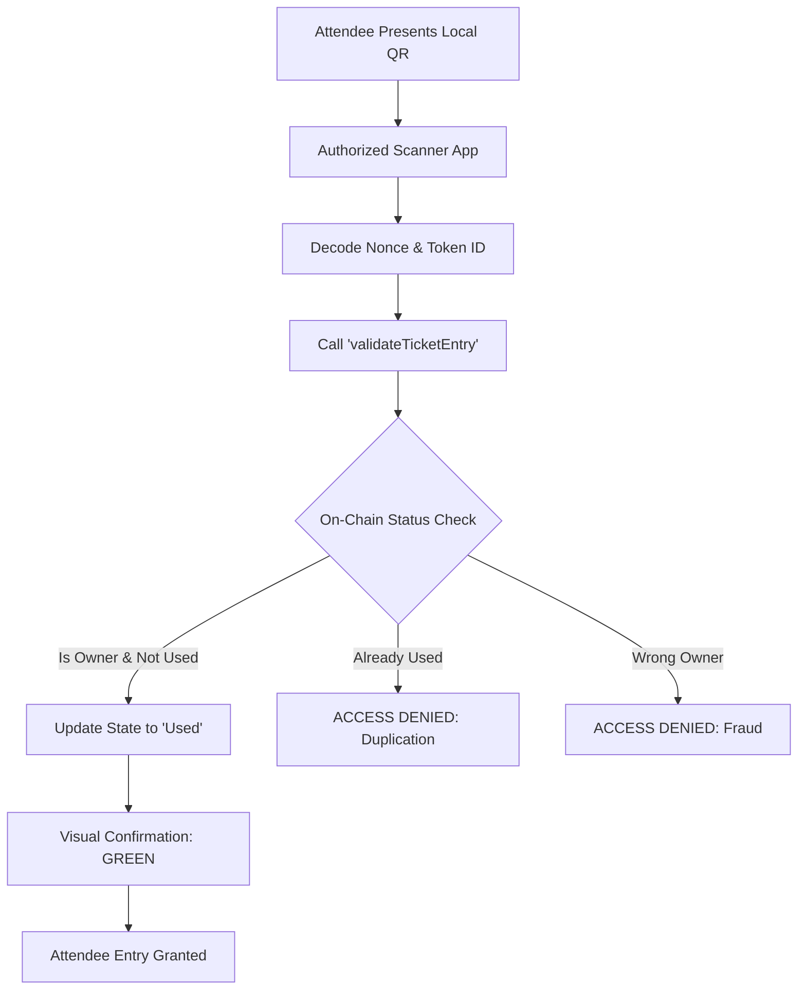
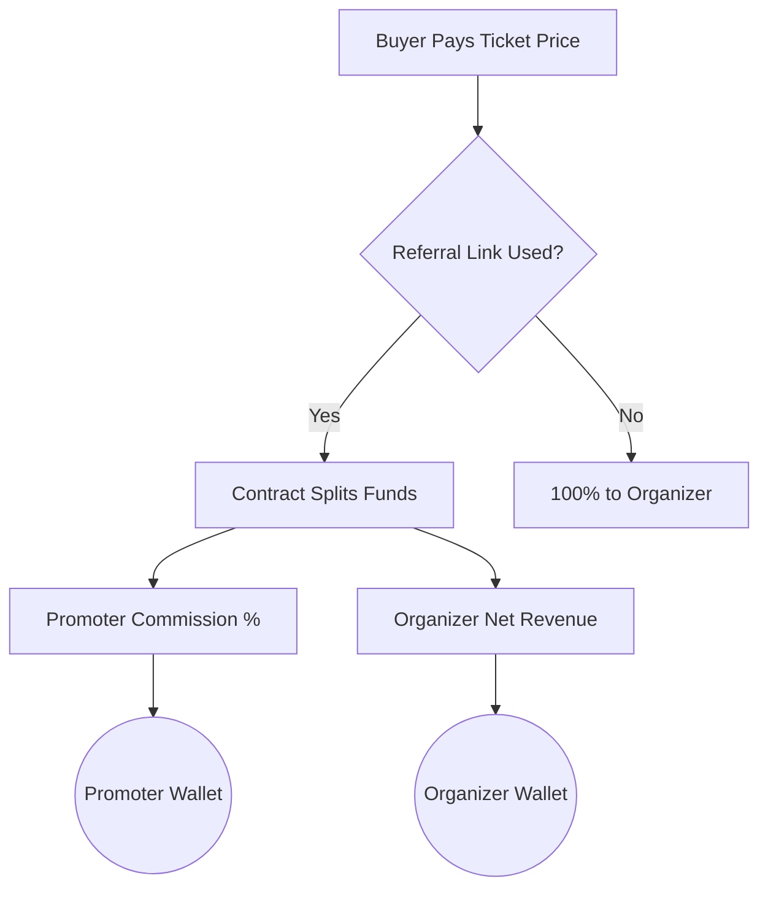
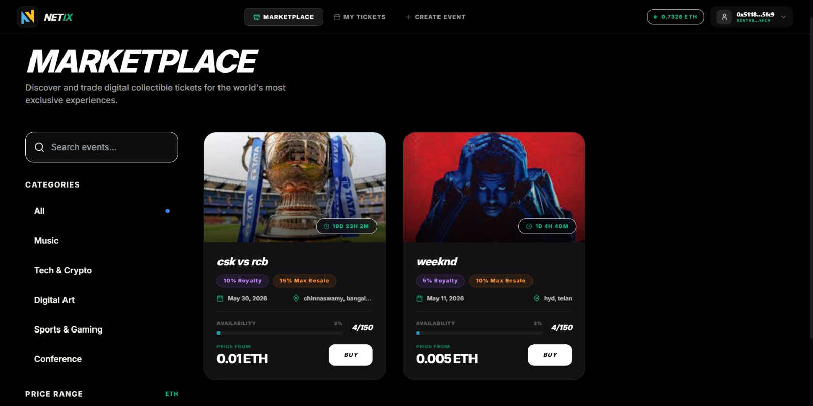
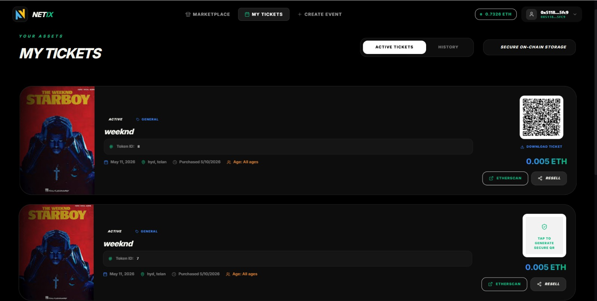

# NETIX — Decentralized NFT Ticketing Revolution 

**Live Demo:** [https://main.d3arrco1req0rn.amplifyapp.com](https://main.d3arrco1req0rn.amplifyapp.com)


**NETIX** is a next-generation decentralized application (dApp) designed to transform the event ticketing industry (Project 7: NFT Event Ticketing). By utilizing Non-Fungible Tokens (NFTs) on the Ethereum blockchain, NETIX eliminates ticket fraud, ensures verifiable ownership, and establishes a fair secondary market with automated royalty enforcement.

---

##  Project Team: Blacknova
| Name | Roll Number | 
| :--- | :--- | 
| **Kadasani Aswartha Karthik Reddy** | 240001036 | 
| **Mannepalli Sai Adithya** | 240001044 | 
| **Yelisetti Vignesh** | 240001083 | 
| **Katasani Vishnu Vardhan Reddy** | 240001040 | 
| **Boddu Kunal** | 240003020 | 
| **Kesavarapu Deepak Reddy** | 240041022 | 

---

##  System Architecture

NETIX follows a decentralized architecture where the frontend interacts directly with the blockchain (Sepolia Testnet) and distributed storage (IPFS).


```mermaid
graph TD
    User((User/Organizer)) -->|Connects Wallet| MM[MetaMask]
    User -->|Interacts| FE[React/Vite Frontend]
    FE -->|Reads/Writes| SC[NFTTicket.sol Contract]
    FE -->|Stores Assets| IPFS[IPFS/Pinata]
    SC -->|Minting/Trades| BC[Ethereum Sepolia]
    SC -->|Royalties| ORG[Organizer Wallet]
```

---

##  Feature Deep-Dive

### 1. Organizer Management Suite
* **Decentralized Event Deployment**: Organizers deploy immutable event contracts with **Multi-Tier support** (Silver, Gold, VIP, etc.).
* **Edit Event Feature**: Organizers can update ticket pricing and supply for each tier post-deployment, allowing for dynamic pricing strategies.
* **Cancel Event Logic**: Organizers can cancel an event by providing full refund liquidity, ensuring every ticket holder can be repaid through an automated pull-payment system.


```mermaid
graph TD
    subgraph Cancellation Phase
    A[Organizer] -->|Calls cancelEvent + ETH| B[Smart Contract]
    B -->|Validate| C{ETH >= Total Sold?}
    C -- No --> D[Transaction Reverted]
    C -- Yes --> E[Set isCancelled = True]
    E --> F[Minting Permanently Disabled]
    end
    
    subgraph Refund Phase
    G[Ticket Holder] -->|Calls claimRefund| B
    B -->|Check| H{Status: Cancelled?}
    H -- Yes --> I[Transfer lastPricePaid]
    I --> J((User Wallet))
    end
```

* **Verification Tools**: Added the **QR Generator** as a primary validation tool. This system ensures secure, one-time entry through on-chain verification.

#### Phase 1: Secure QR Generation (On-Purchase)

```mermaid
graph TD
    A[Buyer Connects MetaMask] --> B[Selects Event Tier & Quantity]
    B --> C[Executes Mint Transaction]
    C --> D[Blockchain assigns Unique Nonce]
    D --> E[Frontend Captures Event Data]
    E --> F[Generate Secure QR Code]
    F --> G[Save QR to LocalStorage]
```

#### Phase 2: Venue Scanning (On-Entry)

```mermaid
graph TD
    H[Attendee Presents Local QR] --> I[Authorized Scanner App]
    I --> J[Decode Nonce & Token ID]
    J --> K[Call 'validateTicketEntry']
    K --> L{On-Chain Status Check}
    L -->|Is Owner & Not Used| M[Update State to 'Used']
    L -->|Already Used| N[ACCESS DENIED: Duplication]
    L -->|Wrong Owner| O[ACCESS DENIED: Fraud]
    M --> P[Visual Confirmation: GREEN]
    P --> Q[Attendee Entry Granted]
```

### On-Chain vs. Off-Chain Architecture
To ensure high performance without sacrificing security, NETIX utilizes a hybrid model:

| Feature | On-Chain (Ethereum Sepolia) | Off-Chain (Local / IPFS) | Technical Rationale |
| :--- | :--- | :--- | :--- |
| **Ticket Ownership** | Verified via immutable ERC-721 ledger | Cached in LocalStorage for instant UI load | Ensures zero-wait time for users to view their assets while keeping security on-chain. |
| **Event Metadata** | IPFS Hash stored in the smart contract | Media assets stored decentrally on **IPFS** | Minimizes on-chain storage costs (gas) while guaranteeing data permanence. |
| **Verification** | Secure `nonce` & `used` status in state | QR code generated & stored on user's device | Prevents double-entry and ticket cloning through cryptographic validation. |
| **Marketplace** | Atomic trades & Royalty distribution | Price discovery & Event browsing (Vite) | Guarantees fair payment to creators without middleman risk. |
| **Refunds** | Funds locked in contract for safety | Refund claim initiated via the dashboard | Uses a "Pull-Payment" pattern to avoid gas-heavy mass distributions. |
| **Access Control** | Authorized Scanner list in contract | Scan attempt initiated by Staff App | Ensures only verified organizers can mark a ticket as "Used". |

* **IPFS-Backed Metadata**: All event banners and descriptions are stored on IPFS, ensuring the data remains permanent and tamper-proof.
* **Referral & Promoter Engine**: 
    * **How it Works**: Organizers can assign specific wallets as "Referrers" with a custom commission rate (basis points).
    * **Access Control**: Only the event organizer has the authority to manage referrers.
    * **Commission** is instantly routed to promoters upon a successful mint.


```mermaid
graph TD
    A[Buyer Pays Ticket Price] --> B{Referral Link Used?}
    B -- Yes --> C[Contract Splits Funds]
    B -- No --> D[100% to Organizer]
    C --> E[Promoter Commission %]
    C --> F[Organizer Net Revenue]
    E --> G((Promoter Wallet))
    F --> H((Organizer Wallet))
```

### 2. Ticketing & Minting Engine
* **Market Integrity**: Re-emphasized the **strict prohibition** on organizers buying their own tickets (Primary & Resale) to prevent artificial floor price inflation.
* **Entry Security**: Highlighted the **Secure QR Validation** system, which uses on-chain nonces to prevent ticket duplication and ensure authentic entry.
* **Batch Purchase Logic**: Optimized smart contract functions allow users to buy multiple tickets across different tiers in a single transaction, saving on gas.

### 3. Secondary Marketplace (P2P)
* **Transparency & Royalties**: Clarified the **EIP-2981 royalty standard** and the **atomic, escrow-less nature of trades**, ensuring organizers receive their cut instantly and securely.
* **Secure Resale with Price Caps**: Owners can list tickets for resale, with prices capped by the organizer (e.g., max 10% markup) to prevent scalping.
* **No Organiser Buying**: Organizers cannot buy tickets on the secondary market to inflate prices.

---

##  Screenshots

### Marketplace


### My Tickets


---

##  Tech Stack Highlights

- **Frontend**: **React 18** with **Vite** for ultra-fast performance.
- **Styling**: **Tailwind CSS** with a custom "Glassmorphism" design system.
- **Animations**: **Framer Motion** for smooth page transitions.
- **State Management**: **Zustand** for lightweight global state management.
- **Blockchain Interaction**: **Ethers.js v6** for secure communication.
- **Smart Contracts**: **Solidity 0.8.20**, utilizing **OpenZeppelin** libraries.

---

##  Prerequisites & Setup

### Requirements
- **Node.js**: `v18.x` or higher
- **Package Manager**: `npm v9.x` or `yarn`
- **Wallet**: **MetaMask** installed.
- **Network**: **Ethereum Sepolia Testnet**.
- **Funds**: Sepolia ETH (Available at [Alchemy Faucet](https://sepoliafaucet.com/)).

### Smart Contract Deployment

To deploy a new instance of the **NFTTicket** contract:

1.  **Configure Root Environment**:
    Create a `.env` file in the **root directory** (not inside `frontend/`):
    ```env
    RPC_URL=[https://eth-sepolia.g.alchemy.com/v2/your_key](https://eth-sepolia.g.alchemy.com/v2/your_key)
    PRIVATE_KEY=your_wallet_private_key
    ```

2.  **Deploy to Sepolia**:
    Run the deployment script using Hardhat:
    ```bash
    npx hardhat run scripts/deploy.js --network sepolia
    ```

3.  **Update Frontend**:
    Once deployed, copy the new contract address from the terminal and update `VITE_CONTRACT_ADDRESS` in `frontend/.env`.

---

###  Frontend & Installation Steps

1.  **Clone & Install Root Dependencies**:
    ```bash
    git clone https://github.com/Sai-Adithya-M/CS218-Blacknova-NFT_EVENT_TICKETING.git
    cd CS218-Blacknova-NFT_EVENT_TICKETING
    npm install
    ```

2.  **Compile Smart Contracts**:
    ```bash
    npx hardhat compile
    ```

3.  **Frontend Setup**:
    ```bash
    cd frontend
    npm install
    ```

4.  **Environment Configuration**:
    Create a `.env` in `frontend/` and add:
    ```env
    VITE_CONTRACT_ADDRESS=your_contract_address
    VITE_PINATA_JWT=your_pinata_jwt_here
    ```

5.  **Run Tests**:
    Verify the smart contract logic with the included test suite:
    ```bash
    npx hardhat test
    ```

6.  **Run Locally**:
    ```bash
    npm run dev
    ```

---

## ⛽ Gas Optimisation

We implemented 11 distinct EVM-level optimization techniques to ensure the platform remains highly affordable, reducing deployment costs by **9.5% (~317,000 gas)** and significantly lowering runtime metrics:

1. **Custom Errors**: Replaced 30+ string `require` statements with custom errors, saving ~200 gas per byte on deployment and 50 gas per revert.
2. **Loop Merging & Storage Caching**: Merged dual loops in batch functions into a single pass. Cached frequently accessed storage variables (`evt.organiser`, `t.sold`), avoiding expensive 2,100 gas cold `SLOAD` operations.
3. **Aggregated Storage Writes**: Accumulated variables like `eventTicketsSold` in memory during loops, writing to storage only once at the end. This saves ~5,000 gas per additional batch tier under EIP-2929 rules.
4. **Inline Assembly**: Utilized Yul assembly for ETH transfers (`call()`) to skip memory allocation for return data, and for Nonce generation directly in scratch space.
5. **Calldata & Unchecked Math**: Transitioned `memory` array parameters to `calldata` (saving 200-600 gas per array), and wrapped monotonic counters in `unchecked` blocks to bypass redundant Solidity 0.8+ overflow checks.
6. **Storage Packing**: Optimized the `TokenData` struct to pack `eventId`, `tier`, `prices`, `refunded` status, and `nonce` into a minimal number of 256-bit storage slots.

---

##  Known Issues & Limitations

- **IPFS Latency**: As noted in Troubleshooting, metadata loading from IPFS can sometimes take 2-3 minutes depending on network congestion.
- **Fixed Tier Count**: Currently, an event's tier count is fixed at creation time; organizers can edit prices/supplies but cannot add new tiers post-deployment.
- **Batch Limit Enforcement**: While a `MAX_BATCH = 10` constant is defined for safety limits, it currently requires an explicit `require/revert` enforcement inside the core batch internal loop to fully mitigate on-chain Denial of Service (DoS) vectors from malicious direct-contract interactions.
- **Single Currency**: All transactions are strictly in ETH (Sepolia Testnet).

---

## Smart Contract Specification (`NFTTicket.sol`)

The NETIX smart contract implements the following core functions with full NatSpec documentation for developers, featuring 12 `external` view functions for optimized off-chain querying.

###  Event Management
- **`createEvent(string ipfsHash, uint8 royaltyBps, uint256[] prices, uint256[] supplies, uint8 maxResaleMarkupPct)`**
    - `@notice`: Initializes a new event with multiple tiers. Implements a critical **Anti-Scalping (`RoyaltyExceedsMarkup`)** check ensuring organizers cannot set a royalty percentage higher than the maximum resale markup, preventing mathematically guaranteed losses for resellers.
    - `@param ipfsHash`: The IPFS CID containing event metadata (banners, description).
    - `@param prices`: Array of ticket prices in Wei for each tier.
- **`editEvent(uint256 eventId, uint256[] newPrices, uint256[] newSupplies)`**
    - `@notice`: Updates the prices and supplies for an existing event's tiers.
    - `@param newSupplies`: Updated max supply (must be >= current sold).
- **`cancelEvent(uint256 eventId)`**
    - `@notice`: Cancels an event and locks funds for ticket holder refunds.
    - `@param eventId`: Unique ID of the event to cancel.

###  Ticketing & Referral
- **`buyTicket(uint256 eventId, uint256 tierId)`**
    - `@notice`: Purchases and mints a single ticket for a specific tier.
- **`buyBatchTickets(uint256 eventId, uint256[] tierIds, uint24[] quantities)`**
    - `@notice`: Optimized multi-tier, multi-quantity purchase in one transaction utilizing single-pass loop architecture.
- **`addReferral(uint256 eventId, address referrer, uint256 bps)`**
    - `@notice`: Configures a referral reward for a specific promoter wallet. 
    - `@param bps`: The commission rate in basis points (e.g. 500 = 5%).

###  Secondary Marketplace
- **`listForResale(uint256 tokenId, uint256 priceWei)`**
    - `@notice`: Lists an owned ticket for resale with strict price cap validation to prevent scalping.
    - `@param priceWei`: Resale price (cannot exceed original price + markup cap).
- **`buyResaleTicket(uint256 tokenId)`**
    - `@notice`: Atomic transfer of NFT with EIP-2981 standard royalty distribution.
- **`claimRefund(uint256 tokenId)`**
    - `@notice`: Allows users to claim a full refund (Pull-Payment pattern) if an event is cancelled.

###  Access Control & Validation
- **`addScanner(uint256 eventId, address scanner)`**
    - `@notice`: Authorizes a wallet address to act as a ticket scanner.
- **`validateTicketEntry(uint256 tokenId, address expectedAttendee)`**
    - `@notice`: Marks a ticket as 'Used' on-chain at the venue gate, validating the cryptographically generated secure nonce.
    - `@param expectedAttendee`: The wallet address of the person presenting the ticket.

---

## 🧪 Testing & Coverage

The smart contract is backed by a comprehensive **73-test** suite covering all critical paths, edge cases, and revert conditions.

```bash
npx hardhat test
```

| Metric | Coverage |
| :--- | :--- |
| **Statements** | 97.65% |
| **Branches** | 73.29% |
| **Functions** | 94.44% |
| **Lines** | 97.24% |

### Test Categories:
* **Event Management** (17 tests): Creation, editing, tier validation, and boundary checks.
* **Ticket Purchasing** (8 tests): Single buy, batch buy, payment validation, and access control.
* **Referral System** (6 tests): Commission routing, authorization, and edge cases.
* **Secondary Marketplace** (6 tests): Resale listing, price cap enforcement, royalty distribution, and non-compounding price validation.
* **Cancellation & Refunds** (6 tests): Event cancellation, fund locking, refund claims, and double-refund prevention.
* **Scanner & Validation** (9 tests): Scanner role management, on-chain ticket validation, and anti-fraud checks.
* **View Functions & EIP-2981** (12 tests): Token data accessors, royalty info, and interface compliance.
* **Referral Payment Verification** (3 tests): End-to-end ETH flow validation for single, batch, and no-referrer scenarios.

To generate a full coverage report:
```bash
npx hardhat coverage
```

---

##  Future Enhancements

-  **Hybrid QR Validation (Database Integration)**: We will integrate a centralized database to handle QR validation scans for real-time performance, while maintaining the blockchain as the source of truth for finality.
-  **Fiat Onramps**: Allow users to buy NFT tickets using credit cards and local currency.
-  **Native Mobile App**: A dedicated mobile experience for organizers to scan tickets and users to manage their assets.
-  **WalletConnect Support**: Expanding accessibility beyond MetaMask to mobile-first wallets.

---

##  Troubleshooting

- **Transaction Reverted**: 
    - Ensure you have enough Sepolia ETH for gas. 
    - If you are the event organizer, remember that **you cannot buy your own tickets**.
- **Price Precision Issue**: If you set an ETH price below `0.0004`, it may be rounded off to `0.001` in the system display. Ensure you check the final price before confirming.
- **Wallet Not Connecting**: Ensure your MetaMask is set to the **Sepolia Test Network**.
- **Images Not Loading**: IPFS gateways can sometimes be slow(2-3 mins), Ensure your Pinata keys are correctly configured and the hash is valid.

---

## 📄 License

This project is licensed under the **MIT License** — see the [LICENSE](LICENSE) file for details.

---

Developed by **Team Blacknova** for the Future of Ticketing.
